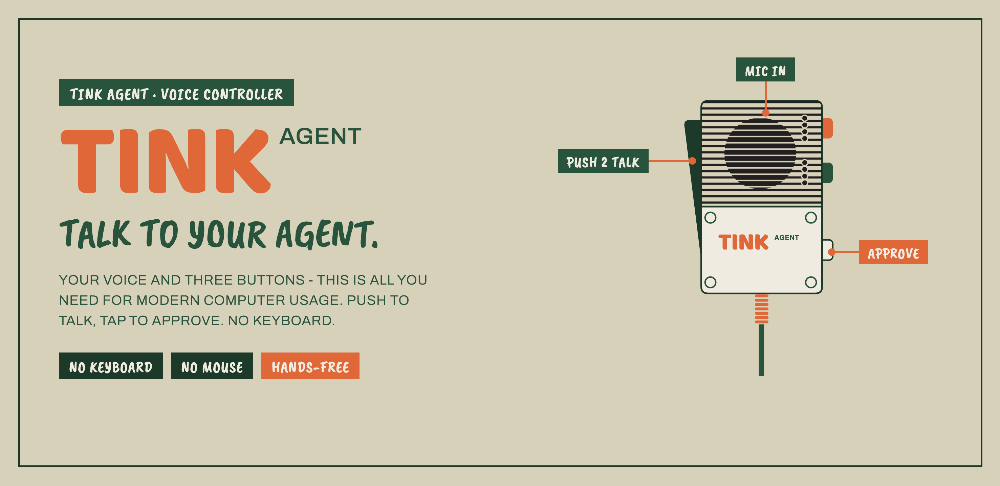
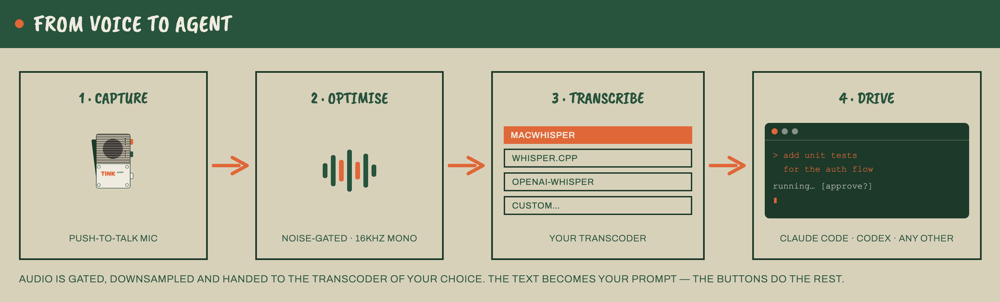
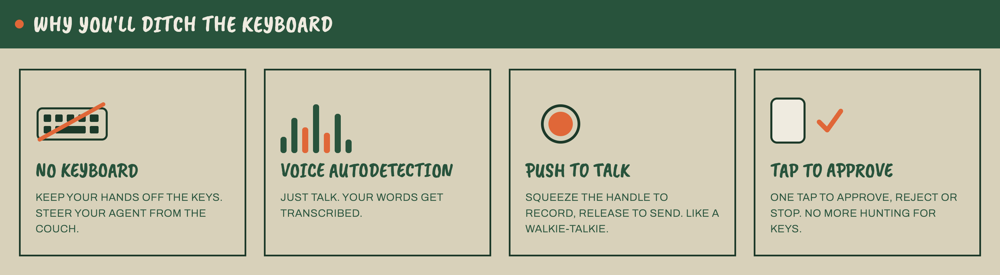
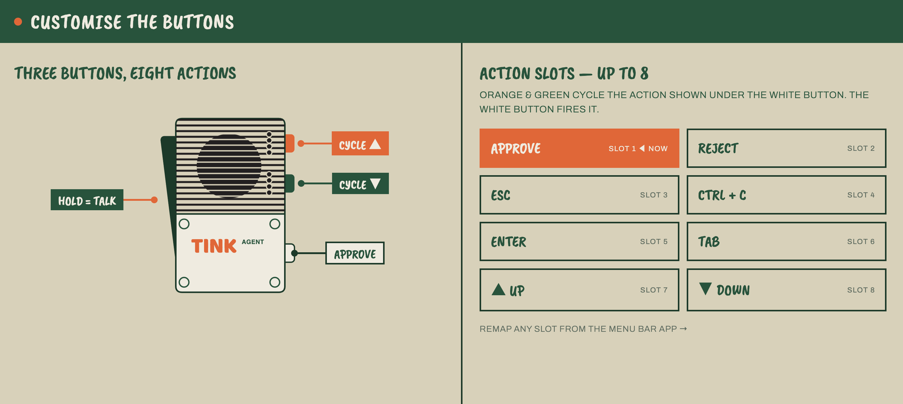
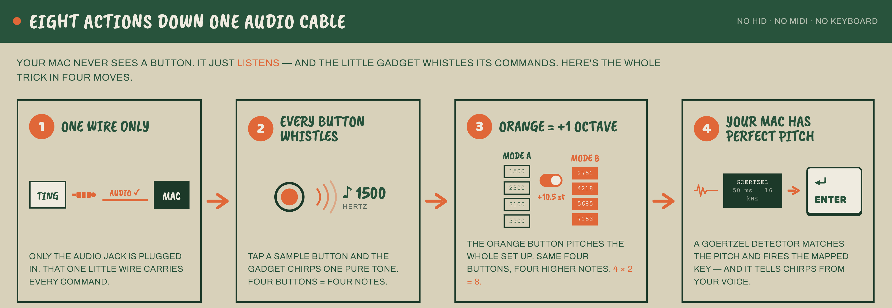

# tink-agent

<p align="center">
  
</p>

Turn a Teenage Engineering EP-2350 "Ting" mic into a voice-and-button controller
for AI coding agents.

Hold the handle, talk to your agent, and let go. Press the mic buttons to approve,
reject, interrupt, move through modes, or send little command macros. No keyboard
shuffle, no hunting for the focused terminal, no "wait, where did I type that?"

It is a macOS menu-bar app with a delightfully weird trick inside: the Ting does not
send button events to the Mac, so tink-agent teaches the mic to play tiny tone cues,
detects those tones in the same audio stream as your voice, and turns them into
keystrokes.

This is part product, part hardware hack, part "the analog line-out is the API."

## Why this is fun

<p align="center">
  
</p>

AI coding agents are conversational, but our hands are still stuck in the old loop:
type a prompt, press Enter, wait, approve, interrupt, switch mode, type again.
tink-agent moves that loop onto a handheld mic.

- Say: "Fix this, make no mistakes."
- Release the handle and let your STT engine type it into Claude Code, Codex, or any
  focused app.
- Tap one mic action to approve the plan. Look ma, no hands.
- Tap another to send Escape, Ctrl-C, arrow keys, `/compact`, or any custom text macro.

The result feels closer to directing an agent than operating a terminal.

<p align="center">
  
</p>

## Core features

- **Push-to-talk voice input** - the Ting handle is the natural talk boundary. Hold,
  speak, release, and tink-agent transcribes the utterance into the focused app.
- **Up to 8 mic-triggered actions** - green selects a slot, white plays it, orange
  switches mode. Mode A gives slots 1-4; mode B gives slots 5-8.
- **Button actions built for agent workflows** - defaults include Enter, Escape,
  Ctrl-C, Shift-Tab, Up, and Down. The catalog also supports Tab, Shift-Enter,
  arrows, Backspace, Paste, `/clear`, `/compact`, `continue`, `yes`, and custom
  `type:<text>` macros.
- **Works with the app you already use** - Claude Code, Codex, iTerm, Terminal, VS
  Code, Cursor, or anything that accepts typed text and keyboard shortcuts.
- **Frontmost-app safety guard** - restrict output to selected apps so a stray prompt
  cannot land in the wrong window.
- **Local-first transcription** - built-in presets for MacWhisper, whisper.cpp, and
  openai-whisper, plus a custom command template for other STT tools.
- **Native macOS menu-bar app** - small status icon, Settings window, onboarding,
  audio-source picker, button mapping UI, optional activity log, and LaunchAgent
  auto-start.

Example mappings:

| Mic move | Default action | Agent use |
|---|---:|---|
| Mode A, slot 1, white | Enter | approve plan / submit prompt |
| Mode A, slot 2, white | Escape | reject, cancel, close popover |
| Mode A, slot 3, white | Ctrl-C | interrupt a runaway command |
| Mode A, slot 4, white | Shift-Tab | cycle agent mode |
| Mode B, slot 1, white | Up | recall previous prompt |
| Mode B, slot 2, white | Down | move forward in prompt history |
| Mode B, slots 3-4 | No-op by default | reserved for your macros |

<p align="center">
  
</p>

## Inspiration

Kudos to [Robert Bye](https://x.com/RobertJBye/status/2069455413028983007) -
his X post inspired this project.

## What you need

- **macOS** - tink-agent is a menu-bar app and installs as a LaunchAgent.
- **Python 3.14** - the repo runs directly with `python -m tink_agent`.
- **Teenage Engineering EP-2350 Ting** - the handheld mic, running on its own
  batteries during normal use.
- **Analog audio path** - Ting line-out into a USB audio adapter. On the reference
  setup this appears as `USB Audio Device`. This is the live connection; tink-agent
  does not use the Ting's USB-C port during normal operation.
- **Speech-to-text software** - choose one:
  - [MacWhisper](https://goodsnooze.gumroad.com/l/macwhisper)
  - `whisper-cli` from [whisper.cpp](https://github.com/ggml-org/whisper.cpp)
  - `whisper` from [openai-whisper](https://github.com/openai/whisper)
  - a custom command that accepts a WAV file and prints or writes text
- **macOS permissions** - Microphone for capture, Accessibility for keystrokes.

## Disclaimer

tink-agent is an independent project. It is not affiliated with, endorsed by, or
supported by Teenage Engineering.

We are just very fond of their hardware. The EP-2350 Ting is a strange, charming
little object, and this project exists because its constraints are interesting.

## The hardware trick

<p align="center">
  
</p>

The Ting's USB-C port is not a live audio or button-data connection. tink-agent uses
USB-C only during initial setup, when you copy `config.json` and the tone samples to
the `TINGDISK` volume. After that, normal operation is battery-powered Ting plus the
analog audio jack.

Audio reaches the Mac through the Ting line-out into a USB audio adapter, and the
buttons do not appear as HID, MIDI, keyboard, serial, or anything else.

So tink-agent treats audio as the one true transport:

```text
Ting handle held
  -> analog line-out
  -> USB audio adapter
  -> one macOS input stream
  -> tone detector + voice gate
  -> keystrokes + transcription
```

The bundled `ting-config/` turns the Ting's sample buttons into short pure-tone cues.
tink-agent watches the audio stream with a Goertzel detector. When it hears one of
the expected frequencies, it fires the mapped action.

The shipped slot layout:

| Slot | Mode | Tone | Default action |
|---:|---|---:|---|
| 1 | A | 1500 Hz | Enter |
| 2 | A | 2300 Hz | Escape |
| 3 | A | 3100 Hz | Ctrl-C |
| 4 | A | 3900 Hz | Shift-Tab |
| 5 | B | 2751 Hz | Up |
| 6 | B | 4218 Hz | Down |
| 7 | B | 5685 Hz | No-op |
| 8 | B | 7153 Hz | No-op |

The orange button selects the Ting preset. In our config, orange position 0 is mode A
and orange position 1 is mode B. Both presets play the same four sample tones, but
mode B pitches them up by +10.5 semitones, giving four more detectable frequencies.

There is one important device gotcha: the factory Ting presets can modulate sample
pitch with the handle position. That smears button tones into the speech band and
makes them unreliable. The bundled `ting-config/config.json` uses fixed-pitch SAMPLE
presets so the tones stay crisp and detectable. Read [TING.md](TING.md) before
changing device config.

## How voice and buttons avoid stepping on each other

tink-agent runs tone detection before voice gating on every audio block.

- A button cue must pass RMS, frequency dominance, and tonality checks. Speech may
  have energy near a tone frequency, but it is not a clean single-frequency signal.
- Blocks classified as tone-active are excluded from the voice buffer, so button
  chirps do not become part of the transcript.
- Short tone edges are below the minimum utterance duration and are discarded by the
  voice gate.
- Transcription runs on a worker thread, never on the PortAudio callback thread.

The nerd version: tones are detected with Goertzel over 50 ms, 16 kHz mono blocks.
Dominance compares the winning tone bin against the other configured bins; tonality
compares that same bin against total block energy. This is why speech does not
accidentally press Enter.

## Install the Ting device config

The app needs the Ting to play the expected tone samples. This is the one-time
USB-C part of setup.

1. Connect the Ting over USB-C and power it on so `TINGDISK` mounts.
2. Wait for the `TINGDISK` volume to mount.
3. Copy the contents of [`ting-config/`](ting-config/) to the root of `TINGDISK`.
4. Restart the Ting. Device config is loaded only at boot.
5. For normal use, disconnect USB-C. Run the Ting from its own batteries and connect
   only the line-out/audio jack to your USB audio adapter.

The app also includes onboarding checks for this flow. If you want the hardware
details, device schema, pitch-modulation notes, and firmware caveats, read
[TING.md](TING.md).

## Install with Homebrew

```bash
brew tap tajchert/tap
brew install tink-agent
tink-agent-install
```

This installs tink-agent and starts the LaunchAgent. Remove the LaunchAgent with:

```bash
tink-agent-uninstall
```

## Setup from source

```bash
python3 -m venv .venv
.venv/bin/pip install -r requirements.txt
```

Run it in development:

```bash
.venv/bin/python -m tink_agent
```

A menu-bar icon appears. The grille fills while tink-agent is capturing voice.

## Install as a menu-bar app

```bash
packaging/install.sh
```

This installs and starts a LaunchAgent at:

```text
~/Library/LaunchAgents/io.github.tajchert.tinkagent.plist
```

Why LaunchAgent instead of a normal `.app` bundle? Because this project runs Python
directly and needs to join the user's GUI session so the menu-bar icon appears
reliably. launchd handles that cleanly.

Remove it:

```bash
packaging/uninstall.sh
```

Runtime logs go to:

```text
~/Library/Logs/TinkAgent.log
```

<p align="center">
  
</p>

## Permissions

Grant permissions in **System Settings -> Privacy & Security**:

- **Microphone** - required to capture the USB audio adapter.
- **Accessibility** - required to type text and synthesize keystrokes.

In development, permissions attach to your terminal. When installed as a LaunchAgent,
they usually attach to the framework **Python** binary. If keystrokes do nothing,
Accessibility is the first thing to check.

## Configuration

User config lives at:

```text
~/.tink-agent/config.json
```

Useful fields:

- `device_name` - input device name substring. Defaults to `USB Audio Device`.
- `stt_backend` - `macwhisper`, `whisper-cpp`, `openai-whisper`, or `custom`.
- `stt_model` - optional model name passed to the selected backend.
- `slot_actions` - maps tone slots 1-8 to action IDs.
- `target_apps` - optional list of app name or bundle-id substrings. Empty means any
  focused app is allowed.
- `log_activity` - writes transcripts and actions to an opt-in TSV activity log.
- tone and VAD thresholds - useful when experimenting with hardware levels.

Most everyday settings are available through the native Settings window: enable/disable,
start at login, audio source, transcription backend, allowed apps, logging, onboarding,
and button mapping.

## Button action catalog

Built-in action IDs include:

```text
enter, escape, esc_esc, ctrl_c, ctrl_d,
tab, shift_tab, shift_enter,
up, down, left, right,
space, backspace, cmd_v,
key_1, key_2, key_3,
type:yes, type:continue, type:/clear, type:/compact,
noop
```

Any `type:<text>` action types the text and then presses Enter. Unknown actions are
safe no-ops.

## Architecture

```text
AudioCapture
  -> Engine.handle_block()
     -> ToneDetector.process()
        -> ActionRouter.fire_slot()
     -> VoiceGate.process()
        -> Transcriber.transcribe()
        -> ActionRouter.type_text()
```

Main modules:

| File | Role |
|---|---|
| `tink_agent/audio.py` | PortAudio capture and device scanning |
| `tink_agent/detector.py` | Goertzel tone detection and energy VAD |
| `tink_agent/engine.py` | Pipeline orchestration, gates, threading, logging |
| `tink_agent/transcribe.py` | External STT command wrapper |
| `tink_agent/actions.py` | Slot-to-action routing and keyboard output |
| `tink_agent/menubar.py` | rumps menu-bar lifecycle |
| `tink_agent/settings_ui.py` | native AppKit Settings window |
| `tink_agent/button_actions.py` | mic button mapping UI |
| `tink_agent/launchagent.py` | macOS LaunchAgent install/startup helpers |
| `tink_agent/config.py` | config loading, saving, and migrations |

Threading model:

- **Audio callback thread** - capture, tone detection, VAD. Must stay fast.
- **Transcription worker** - shells out to STT and types returned text.
- **Main thread** - menu-bar UI, AppKit, and keyboard dispatch.

## Tech stack

- Python
- rumps for the menu-bar shell
- PyObjC / AppKit for Settings and onboarding
- sounddevice / PortAudio for audio capture
- numpy + Goertzel for tone detection
- external STT CLI: MacWhisper, whisper.cpp, openai-whisper, or custom
- pynput for keyboard output
- pytest for offline tests
- LaunchAgent for macOS startup

## Tests

```bash
.venv/bin/pytest -q
```

Most OS-touching dependencies are injected, so tests run without the Ting, microphone
permissions, Accessibility permissions, or an installed STT tool. Real audio fixtures
cover the important regressions: speech should not fire actions, and configured tones
should detect in order.

## Project docs

- [TING.md](TING.md) - device research, Ting config schema, hardware gotchas.
- [AGENTS.md](AGENTS.md) - developer guide for the repo architecture.

## License

MIT. See [LICENSE](LICENSE).
